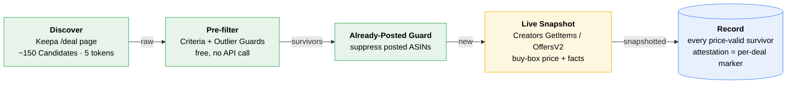
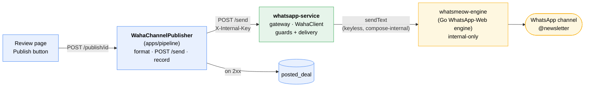

# Deal Promoter

Finds genuine Amazon deals via Keepa, re-confirms them live against the Amazon
Creators API, and publishes the affiliate-tagged links to a WhatsApp channel. A
PHP 8.5 / Symfony 8 / Docker monorepo.

**What ships today:** the headless **Deal Pipeline** (`apps/pipeline`) with its
review page, **plus** a standalone **WhatsApp gateway** (`apps/whatsapp-service`)
that delivers a reviewed deal to a real WhatsApp channel via [WAHA](GLOSSARY.md).
The full chain runs end to end: discover → snapshot → record → review → **publish**.
Clicking *Publish* on a recorded deal now posts the German-formatted affiliate
message to the channel and writes it to Recorded Price History so it is never
re-posted.

The full vision lives in [`docs/specs/product.md`](docs/specs/product.md); the
pipeline build spec in [`apps/pipeline/docs/specs/pipeline.md`](apps/pipeline/docs/specs/pipeline.md);
the gateway spec in [`apps/whatsapp-service/docs/specs/whatsapp-service.md`](apps/whatsapp-service/docs/specs/whatsapp-service.md);
the canonical vocabulary in [`GLOSSARY.md`](GLOSSARY.md). Read the glossary first
if a capitalised term below is unfamiliar.

## Quick start

Everything runs inside the `app` container; you only need Docker.

```sh
cp .env.example .env   # fill in Keepa + Creators creds (WhatsApp keys optional until you publish)
make setup             # start containers, install deps, migrate dev + test DBs
make qa                # green check that the stack is wired correctly
make cycle             # run one real Cycle (spends Keepa + Creators tokens)
make review            # → http://localhost:8000  (the review page)
```

New here? Read [`GLOSSARY.md`](GLOSSARY.md), then
[`docs/research/experiments-summary.md`](docs/research/experiments-summary.md),
then skim the [ADRs](docs/adr/). The deeper sections below explain the pipeline,
`packages/shared` seam pattern, and the WhatsApp gateway. **Agents:** `make qa`
must stay green (PHPUnit + PHPStan max + CS-Fixer); the `test` DB needs
`make migrate-test` after any migration.

## Layout

```
apps/pipeline/                 Symfony 8 app: the run-cycle command + review page
apps/whatsapp-service/          Symfony 8 gateway: the only thing that talks to WAHA
packages/shared/               cross-cutting integration code (reused across apps)
packages/creatorsapi-php-sdk/  vendored official Amazon Creators SDK v1.2.0 (path repo)
experiments/                   throwaway TypeScript probes that proved the funnel (01-09)
docs/                          product spec + API research briefs + ADRs
GLOSSARY.md                    canonical terms (Candidate, Pre-filter, Live Snapshot, ...)
docker-compose.yml             app + postgres + waha + whatsapp-service
```

It is a monorepo. `apps/pipeline` requires `packages/shared` and the vendored SDK
as Composer **`path` repositories** (the SDK ships as a download, not on
Packagist), so everything resolves offline inside the container. The gateway is
deliberately standalone — it shares **no** `packages/shared` and **no** database
([ADR 0001](docs/adr/0001-standalone-whatsapp-gateway.md)).

## The pipeline

One Symfony Console command, `app:run-cycle`, runs a [Cycle](GLOSSARY.md) end to
end. It is idempotent, guarded by a non-blocking **run-lock** (two Cycles never
overlap), and **fail-safe**: any dependency error skips the whole Cycle with no
partial row persisted.



<sub>🟢 free · 🟡 paid API call · 🔵 persisted</sub>

1. **Discover** — Keepa `/deal` page of up to 150 raw [Candidates](GLOSSARY.md)
   for a flat 5 tokens. Hand-rolled client (no official SDK exists).
2. **Pre-filter** (free) — editable [Criteria](GLOSSARY.md) (discount %, price
   band, sales rank, categories, rating) plus four [Outlier Guards](GLOSSARY.md)
   (spike-polluted baseline, no-demand, price-floor, absurd-claim). No paid call
   is made until a Candidate survives this.
3. **Already-Posted Guard** — drops ASINs already in [Recorded Price History](GLOSSARY.md),
   subject to the [Repost Policy](GLOSSARY.md). Now that publishing writes
   `posted_deal` rows, this actively suppresses re-posting a deal in a later Cycle.
4. **Live Snapshot** — Creators `GetItems` with `OffersV2` for survivors, batched
   10 ASINs/call. Captures live buy-box price, availability, condition, merchant,
   savings, deal flags, and the affiliate `detailPageURL` (passed through
   verbatim, never rebuilt).
5. **Record** — persist one `found_deal` row for **every price-valid survivor**
   that returns a snapshot. **[Amazon Attestation](GLOSSARY.md)** (`dealDetails` or
   a `WAS_PRICE` savings basis) no longer gates recording — it rides along as a
   per-deal marker, surfaced as a badge on the review page.

### Two decisions that shaped the current command

- **Attestation is a marker, not a record gate.** A Live Snapshot confirms a price
  is *real and buyable*, but every discount *baseline* we have (Keepa `avg90`,
  Amazon `LIST_PRICE`) is gameable or polluted. Attestation is still the only
  trustworthy proof of discount size, but rather than dropping unattested
  survivors, the command **records them all** and flags the attested ones, leaving
  the publish/skip judgement to a later Deal Gate and the human reviewer
  ([GLOSSARY: Amazon Attestation](GLOSSARY.md)).
- **Fixed-sweep pagination with cross-run continuation.** A Cycle sweeps a fixed
  `pagesPerCycle` (default `2`) batch of `/deal` pages, tuned in `services.yaml`.
  Crucially it does **not** restart at page 0 each run: a **[Page Cursor](GLOSSARY.md)**
  (`cycle_run.next_start_page`) records where the last Cycle stopped, so successive
  Cycles walk deeper into the feed and wrap back to the top only on reaching the
  end ([ADR 0004](docs/adr/0004-cross-run-page-cursor-on-cyclerun.md)). Pages are
  also cached (`CachingKeepaDiscovery`) so repeat fetches within the TTL re-spend
  no Keepa tokens.

### Review page

`GET /` renders the **latest** Cycle's recorded deals as a read-only table (title,
image, price, Keepa %, Amazon savings + basis, attestation flags, affiliate link).
Each row with an affiliate link has a **Publish button** that POSTs through the
`ChannelPublisher` seam to the live `WahaChannelPublisher` (below); rows without a
link cannot be published and show no button. A successful publish marks the row
and records the deal; a failure flashes the error and persists nothing, so the
button stays clickable.

## `packages/shared`

Cross-cutting code, kept dependency-light so later apps reuse it. The pattern
throughout: **interfaces (seams) live in `shared`, infrastructure-bound
implementations live app-side** so `shared` never imports Doctrine, the SDK, or a
logger.


The command depends only on the seams; swapping an implementation (e.g. a real
`WahaChannelPublisher`) is a one-line rebind in `services.yaml`.

| Area | In `shared` | App-side implementation |
|------|-------------|-------------------------|
| Keepa | `KeepaDiscovery` interface, `KeepaClient` (HTTP), `DealParser`, `Candidate`, `TokenMeter`, `DealPage` | `CachingKeepaDiscovery` (caching decorator) |
| Pre-filter | `PreFilter`, `Criteria`, `GuardThresholds`, `RejectionReason` | `PreFilterFactory` (builds from YAML) |
| Already-Posted | `AlreadyPostedGuard`, `RepostPolicy`, `NeverRepostPolicy` | (none) |
| Creators | `CreatorsClient` interface, `LiveSnapshot` | `SdkCreatorsClient` (wraps the SDK) |
| Storage | `RecordedPriceHistory` interface | `DoctrineRecordedPriceHistory` |
| Channel | `ChannelPublisher`, `PublishableDeal` interfaces | `WahaChannelPublisher` (live) · `NullChannelPublisher` (used under `when@test`) |

## The WhatsApp gateway

`apps/whatsapp-service` is a standalone Symfony 8 app and the **only** component
that talks to `whatsmeow-engine` — the self-hosted Go WhatsApp-Web engine
([ADR 0001](docs/adr/0001-standalone-whatsapp-gateway.md)). The engine is keyless
and **internal-only** (no published host port): only the gateway reaches it over
the compose network. `apps/whatsapp-service` carries no database and no
`packages/shared`; its `WahaClient` is the single component that calls the engine.



**Two trust gates, kept separate** ([ADR 0002](docs/adr/0002-send-trust-boundary.md)):

- `X-Internal-Key` gates the machine path. The pipeline calls the gateway's JSON
  `POST /send` with this header; a missing or wrong key returns **401 before any
  guard or engine call**, and the gateway **fails closed** (a blank configured key
  rejects everything).
- The engine itself needs no second key: it is keyless and reachable only on the
  compose network, so the trust boundary is the network, not a header.

The gateway also serves the **attended** surfaces a machine cannot drive: a
pairing page (scan a QR to connect a WhatsApp account, persisted in the engine's
SQLite volume) and an open, host-bound `POST /ui/send` manual send form. Both the machine `/send`
and the human `/ui/send` funnel through **one** delivery path — same
`@newsletter` + non-empty guards, same `WahaClient::sendText`.

`WahaChannelPublisher` lives in `apps/pipeline` (not `shared`) because it depends
on Doctrine + `PostedDeal` ([ADR 0003](docs/adr/0003-publisher-owns-posted-deal.md)).
It formats the German message (`{title}` / `12,99 €` / blank line / affiliate
URL), POSTs it, and on a 2xx **writes one `posted_deal` row**; on any failure it
throws and persists nothing. That row is what the [Already-Posted Guard](GLOSSARY.md)
reads next Cycle to suppress a re-post.

## Stack & conventions

- **PHP 8.5** (8.4 floor), **Symfony 8.x**, **Postgres 16**, **Doctrine ORM 3 /
  DBAL 4** behind the storage interface, run-lock via the Symfony Lock component.
- **Money is integer euro-cents** everywhere in the domain. The decimal-euro
  `Money.amount` from Creators is converted once at the SDK boundary; the float
  never crosses inward. Never compare prices with `===` across the Keepa-cents /
  Creators-euros boundary.
- **Keepa is metered by tokens** (~20/min on the entry tier; a `/deal` page costs
  5). The design Pre-filters hard on the cheap call and only deep-fetches
  survivors. The command stops paginating before a page it cannot fund.
- Tables: `cycle_run` (funnel counts + owned rows + `next_start_page`, the
  cross-run [Page Cursor](GLOSSARY.md)), `found_deal` (Keepa signals + snapshot
  facts), `posted_deal` (Recorded Price History; written by `WahaChannelPublisher`
  on a successful publish).

## Running it

Everything runs inside the `app` container (PHP 8.5 CLI + Symfony's built-in
server). Postgres is exposed on host `5434`. A `Makefile` wraps the common
operations; run `make` for the full list.

```sh
cp .env.example .env   # fill in Keepa + Creators credentials (see below)
make setup             # start containers, install deps, run migrations
make cycle             # run one Cycle (override detail with ARGS=-v)
make review            # print the review page URL (http://localhost:8000)
```

| `make` target | Does |
|---------------|------|
| `setup` | First run: `up` + `install` + `migrate` + `migrate-test` |
| `up` / `down` / `restart` | Manage the stack |
| `migrate` / `migrate-test` | Run migrations on the dev / test database |
| `cycle` | Run one Cycle (`ARGS=-vv` by default) |
| `qa` | Full QA suite (phpunit + phpstan + cs-fixer) |
| `shell` / `logs` | Drop into the container / tail logs |

After adding a migration, run both `make migrate` and `make migrate-test` (or just
`make setup`) so the dev and test schemas stay in lock-step — PHPUnit boots the
`test` database and will fail against a stale schema.

`.env` (git-ignored; only `.env.example` is committed and edited) needs a Keepa
API key and Amazon Creators LWA credentials (`CREATORS_CREDENTIAL_ID`/`SECRET`,
`CREATORS_VERSION=3.2`, marketplace, `AMAZON_PARTNER_TAG`). To publish, it also
needs the WhatsApp keys: `WHATSAPP_INTERNAL_KEY` (pipeline ↔ gateway — the same
value flows to both sides) and `WHATSAPP_CHANNEL_ID` (the target `@newsletter`
channel). The engine is keyless, so there is no `WAHA_API_KEY`. See `.env.example`.

### Publishing locally

`docker compose up -d` brings up `whatsmeow-engine` (internal-only, no host port)
and the gateway (`127.0.0.1:8001`) alongside the pipeline (`8000`). One-time
setup: open the gateway, click **Connect WhatsApp**, and scan the QR with the
phone that owns the channel — the pairing persists in the engine's SQLite volume
(`whatsmeow_data`), so it survives container restarts. Then the review page's
*Publish* button delivers live. The gateway's `/ui/send` form is a manual send
surface for testing a channel without the pipeline.

## Tuning without code changes

- **Pre-filter thresholds** — `apps/pipeline/config/packages/pre_filter.yaml`
  (Criteria + Outlier Guards). Edits take effect next Cycle.
- **Pages per Cycle, snapshot cap, throttle, cache TTL** —
  `apps/pipeline/config/services.yaml` (`RunCycleCommand.$pagesPerCycle`,
  `SdkCreatorsClient`, `CachingKeepaDiscovery` arguments). The cross-run page
  cursor is automatic and needs no tuning.
- **Swapping the publisher** — rebind the `ChannelPublisher` alias in
  `services.yaml` (live `WahaChannelPublisher` in prod/dev; `NullChannelPublisher`
  under `when@test` so tests make no real HTTP call); nothing else changes.

## Research & learnings

The funnel was proven end to end against live amazon.de by throwaway TypeScript
probes (`experiments/01`-`09`) before any PHP was written. The learnings ported
straight into the production clients. Three documents capture them:

- [`docs/research/experiments-summary.md`](docs/research/experiments-summary.md)
  — the critical question each probe answered. **Read this first.**
- [`docs/research/keepa.md`](docs/research/keepa.md) — Keepa API brief (token
  economics, `/deal` decoding quirks, the Outlier Guards).
- [`docs/research/creators-api.md`](docs/research/creators-api.md) — Amazon
  Creators API brief (LWA auth, `GetItems` / `OffersV2`, attestation fields).

The findings that shaped the code:

- **Never publish a price you have not just re-confirmed with a fresh Live
  Snapshot.** This is why the funnel always ends in a Creators call before any
  publish; Keepa is discovery and ranking only.
- **The Live Snapshot proves Price Validity, not Discount Magnitude.** A snapshot
  confirms a price is real and buyable, but the "% off" rests on a baseline, and
  every baseline is gameable or polluted (Keepa `avg90` is Price-Outlier-polluted;
  Amazon `LIST_PRICE` is seller-set MSRP). Only **Amazon Attestation**
  (`dealDetails` or `WAS_PRICE`) is trustworthy, and it is rare (~1 in 10). Rather
  than discard the rest, the command records every price-valid survivor and flags
  the attested ones — attestation is the trust *signal*, not a record gate (see the
  decisions above).
- **The four Outlier Guards run on the free `/deal` payload alone** — no paid call
  needed to reject the bulk of junk (spike-polluted baselines, no-demand, sub-€2
  floors, absurd >97% claims).
- **The deep `/product?stats` confirmation stage was dropped** — it rejected 0/26
  survivors in testing and cannot un-pollute a bad Reference Price; the magnitude
  fix lives in the Creators attestation fields, not a third Keepa call.

## Quality

PHPUnit 13, PHPStan 2.x at `max` (Doctrine + Symfony extensions), PHP-CS-Fixer 3
(Symfony ruleset). All three must pass.

```sh
make qa     # phpunit + phpstan + cs-fixer (dry-run); or: make test / phpstan / cs
```

PHPUnit boots the **`test`** database, so it must be migrated first — `make setup`
does this, or run `make migrate-test` after adding a migration. Tests covering the
paid APIs run against recorded fixtures
(`packages/shared/tests/fixtures/`); a live smoke is a manual follow-up, never a
merge blocker. The same applies to the gateway: WAHA is mocked in tests
(`docker compose exec whatsapp-service composer qa`), and pairing + a real channel
delivery are verified by hand, since no QR scan or live send can be unit-tested.
