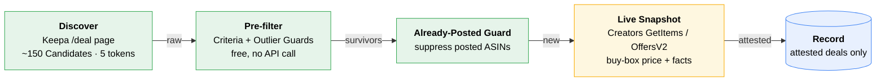
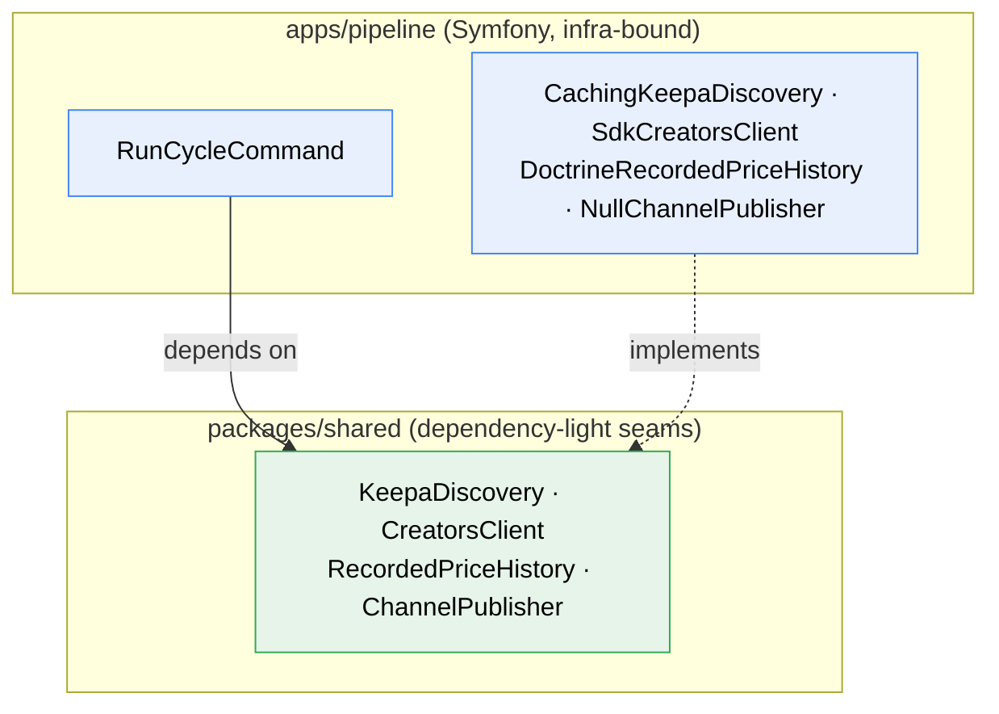

# Deal Promoter

Finds genuine Amazon deals via Keepa, re-confirms them live against the Amazon
Creators API, and (eventually) publishes the affiliate-tagged links to a WhatsApp
channel on a schedule. A PHP 8.5 / Symfony 8 / Docker monorepo.

**What ships today:** the headless **Deal Pipeline** (`apps/pipeline`) plus a
read-only review page. It runs the full funnel up to *record*. Publishing to
WhatsApp is deliberately out of scope for now: the Publish button is a stub
wired onto a `ChannelPublisher` seam that a future WhatsApp container fills in.

The full vision lives in [`docs/specs/product.md`](docs/specs/product.md); the
pipeline build spec in [`apps/pipeline/docs/specs/pipeline.md`](apps/pipeline/docs/specs/pipeline.md);
the canonical vocabulary in [`GLOSSARY.md`](GLOSSARY.md). Read the glossary first
if a capitalised term below is unfamiliar.

## Layout

```
apps/pipeline/                 Symfony 8 app: the run-cycle command + review page
packages/shared/               cross-cutting integration code (reused by future apps)
packages/creatorsapi-php-sdk/  vendored official Amazon Creators SDK v1.2.0 (path repo)
experiments/                   throwaway TypeScript probes that proved the funnel (01-09)
docs/                          product spec + API research briefs
GLOSSARY.md                    canonical terms (Candidate, Pre-filter, Live Snapshot, ...)
docker-compose.yml             app + postgres (waha/whatsapp-service are future stubs)
```

It is a monorepo. `apps/pipeline` requires `packages/shared` and the vendored SDK
as Composer **`path` repositories** (the SDK ships as a download, not on
Packagist), so everything resolves offline inside the container.

## The pipeline

One Symfony Console command, `app:run-cycle`, runs a [Cycle](GLOSSARY.md) end to
end. It is idempotent, guarded by a non-blocking **run-lock** (two Cycles never
overlap), and **fail-safe**: any dependency error skips the whole Cycle with no
partial row persisted.



<sub>🟢 free · 🟡 paid API call · 🔵 persisted</sub>

1. **Discover** — Keepa `/deal` page of up to 150 raw [Candidates](GLOSSARY.md)
   for a flat 5 tokens. Hand-rolled client (no official SDK exists).
2. **Pre-filter** (free) — editable [Criteria](GLOSSARY.md) (discount %, price
   band, sales rank, categories, rating) plus four [Outlier Guards](GLOSSARY.md)
   (spike-polluted baseline, no-demand, price-floor, absurd-claim). No paid call
   is made until a Candidate survives this.
3. **Already-Posted Guard** — drops ASINs already in [Recorded Price History](GLOSSARY.md),
   subject to the [Repost Policy](GLOSSARY.md). A no-op until publishing exists,
   but wired through the storage interface now.
4. **Live Snapshot** — Creators `GetItems` with `OffersV2` for survivors, batched
   10 ASINs/call. Captures live buy-box price, availability, condition, merchant,
   savings, deal flags, and the affiliate `detailPageURL` (passed through
   verbatim, never rebuilt).
5. **Record** — persist one `found_deal` row per Cycle for every deal carrying
   **[Amazon Attestation](GLOSSARY.md)** (`dealDetails` or a `WAS_PRICE` savings
   basis), the only trustworthy proof of discount size.

### Two decisions that shaped the current command

- **Strict dial.** A Live Snapshot confirms a price is *real and buyable*, but
  every discount *baseline* we have (Keepa `avg90`, Amazon `LIST_PRICE`) is
  gameable or polluted. So the command records **only attested deals**. Snapshots
  that are price-valid but unattested are counted and shown in verbose output, not
  persisted. This is the "Strict" end of the volume-vs-trust dial discussed in the
  product spec.
- **Pagination.** Attestation is rare (~1 in 10 snapshotted items), so a Cycle
  walks several `/deal` pages until it has enough attested deals or hits a ceiling.
  Tuned by `maxPages` and `targetAttestedDeals` in `services.yaml`. Pages are
  cached (`CachingKeepaDiscovery`) so repeat Cycles within the TTL re-spend no
  Keepa tokens.

### Review page

`GET /` renders the **latest** Cycle's recorded deals as a read-only table (title,
image, price, Keepa %, Amazon savings + basis, attestation flags, affiliate link).
Each row has a **Publish button** that POSTs to a stubbed `ChannelPublisher`
(`NullChannelPublisher` logs intent and marks the row). It is the seam the future
WhatsApp container plugs into with no controller or template change.

## `packages/shared`

Cross-cutting code, kept dependency-light so later apps reuse it. The pattern
throughout: **interfaces (seams) live in `shared`, infrastructure-bound
implementations live app-side** so `shared` never imports Doctrine, the SDK, or a
logger.



The command depends only on the seams; swapping an implementation (e.g. a real
`WahaChannelPublisher`) is a one-line rebind in `services.yaml`.

| Area | In `shared` | App-side implementation |
|------|-------------|-------------------------|
| Keepa | `KeepaDiscovery` interface, `KeepaClient` (HTTP), `DealParser`, `Candidate`, `TokenMeter`, `DealPage` | `CachingKeepaDiscovery` (caching decorator) |
| Pre-filter | `PreFilter`, `Criteria`, `GuardThresholds`, `RejectionReason` | `PreFilterFactory` (builds from YAML) |
| Already-Posted | `AlreadyPostedGuard`, `RepostPolicy`, `NeverRepostPolicy` | (none) |
| Creators | `CreatorsClient` interface, `LiveSnapshot` | `SdkCreatorsClient` (wraps the SDK) |
| Storage | `RecordedPriceHistory` interface | `DoctrineRecordedPriceHistory` |
| Channel | `ChannelPublisher`, `PublishableDeal` interfaces | `NullChannelPublisher` (stub) |

## Stack & conventions

- **PHP 8.5** (8.4 floor), **Symfony 8.x**, **Postgres 16**, **Doctrine ORM 3 /
  DBAL 4** behind the storage interface, run-lock via the Symfony Lock component.
- **Money is integer euro-cents** everywhere in the domain. The decimal-euro
  `Money.amount` from Creators is converted once at the SDK boundary; the float
  never crosses inward. Never compare prices with `===` across the Keepa-cents /
  Creators-euros boundary.
- **Keepa is metered by tokens** (~20/min on the entry tier; a `/deal` page costs
  5). The design Pre-filters hard on the cheap call and only deep-fetches
  survivors. The command stops paginating before a page it cannot fund.
- Tables: `cycle_run` (funnel counts + owned rows), `found_deal` (Keepa signals +
  snapshot facts), `posted_deal` (Recorded Price History; written by the future
  publish step).

## Running it

Everything runs inside the `app` container (PHP 8.5 CLI + Symfony's built-in
server). Postgres is exposed on host `5434`. A `Makefile` wraps the common
operations; run `make` for the full list.

```sh
cp .env.example .env   # fill in Keepa + Creators credentials (see below)
make setup             # start containers, install deps, run migrations
make cycle             # run one Cycle (override detail with ARGS=-v)
make review            # print the review page URL (http://localhost:8000)
```

| `make` target | Does |
|---------------|------|
| `setup` | First run: `up` + `install` + `migrate` |
| `up` / `down` / `restart` | Manage the stack |
| `cycle` | Run one Cycle (`ARGS=-vv` by default) |
| `qa` | Full QA suite (phpunit + phpstan + cs-fixer) |
| `shell` / `logs` | Drop into the container / tail logs |

`.env` (git-ignored; only `.env.example` is committed and edited) needs a Keepa
API key and Amazon Creators LWA credentials (`CREATORS_CREDENTIAL_ID`/`SECRET`,
`CREATORS_VERSION=3.2`, marketplace, `AMAZON_PARTNER_TAG`). See `.env.example`.

## Tuning without code changes

- **Pre-filter thresholds** — `apps/pipeline/config/packages/pre_filter.yaml`
  (Criteria + Outlier Guards). Edits take effect next Cycle.
- **Pagination, snapshot cap, throttle, cache TTL** —
  `apps/pipeline/config/services.yaml` (`RunCycleCommand`, `SdkCreatorsClient`,
  `CachingKeepaDiscovery` arguments).
- **Swapping a real publisher** — rebind the `ChannelPublisher` alias in
  `services.yaml`; nothing else changes.

## Research & learnings

The funnel was proven end to end against live amazon.de by throwaway TypeScript
probes (`experiments/01`-`09`) before any PHP was written. The learnings ported
straight into the production clients. Three documents capture them:

- [`docs/research/experiments-summary.md`](docs/research/experiments-summary.md)
  — the critical question each probe answered. **Read this first.**
- [`docs/research/keepa.md`](docs/research/keepa.md) — Keepa API brief (token
  economics, `/deal` decoding quirks, the Outlier Guards).
- [`docs/research/creators-api.md`](docs/research/creators-api.md) — Amazon
  Creators API brief (LWA auth, `GetItems` / `OffersV2`, attestation fields).

The findings that shaped the code:

- **Never publish a price you have not just re-confirmed with a fresh Live
  Snapshot.** This is why the funnel always ends in a Creators call before any
  publish; Keepa is discovery and ranking only.
- **The Live Snapshot proves Price Validity, not Discount Magnitude.** A snapshot
  confirms a price is real and buyable, but the "% off" rests on a baseline, and
  every baseline is gameable or polluted (Keepa `avg90` is Price-Outlier-polluted;
  Amazon `LIST_PRICE` is seller-set MSRP). Only **Amazon Attestation**
  (`dealDetails` or `WAS_PRICE`) is trustworthy, and it is rare (~1 in 10). This is
  the direct cause of the Strict dial above.
- **The four Outlier Guards run on the free `/deal` payload alone** — no paid call
  needed to reject the bulk of junk (spike-polluted baselines, no-demand, sub-€2
  floors, absurd >97% claims).
- **The deep `/product?stats` confirmation stage was dropped** — it rejected 0/26
  survivors in testing and cannot un-pollute a bad Reference Price; the magnitude
  fix lives in the Creators attestation fields, not a third Keepa call.

## Quality

PHPUnit 13, PHPStan 2.x at `max` (Doctrine + Symfony extensions), PHP-CS-Fixer 3
(Symfony ruleset). All three must pass.

```sh
make qa     # phpunit + phpstan + cs-fixer (dry-run); or: make test / phpstan / cs
```

Tests covering the paid APIs run against recorded fixtures
(`packages/shared/tests/fixtures/`); a live smoke is a manual follow-up, never a
merge blocker.
